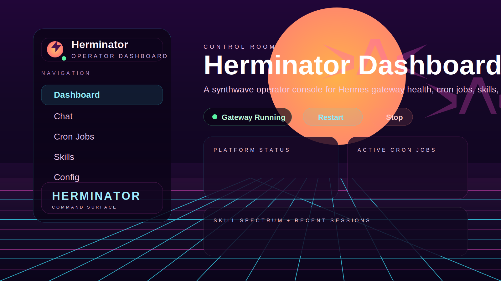
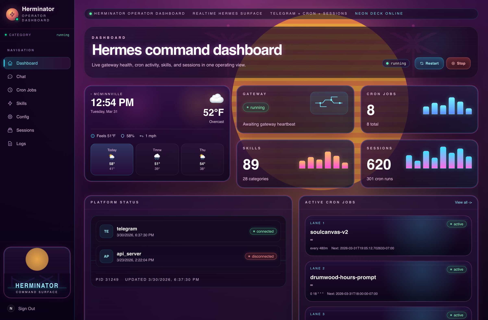
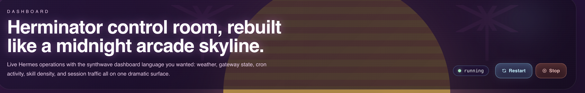
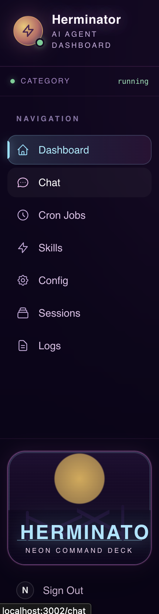

# Herminator Dashboard

<p align="center">
  
</p>

<p align="center">
  <strong>A synthwave operator console for managing local Hermes AI agent installations.</strong>
</p>

<p align="center">
  <a href="#quick-start">Quick Start</a> &nbsp;&middot;&nbsp;
  <a href="#features">Features</a> &nbsp;&middot;&nbsp;
  <a href="#screenshots">Screenshots</a> &nbsp;&middot;&nbsp;
  <a href="#stack">Stack</a> &nbsp;&middot;&nbsp;
  <a href="https://github.com/smittyPNW/Auto-Novel-ChatGPT/issues">Issues</a> &nbsp;&middot;&nbsp;
  <a href="./LICENSE">MIT License</a>
</p>

---

## What Is This

Herminator Dashboard is a full-featured web control panel for [Hermes](https://github.com/hermes-agent), an open-source AI agent framework. Instead of managing your agent through scattered terminals and config files, you get a single operator console with a retro synthwave aesthetic.

It reads live state directly from your local Hermes installation -- gateway health, cron jobs, skills, sessions, logs, and config -- and lets you control everything from one place.

## Features

- **Gateway Controls** -- Start, stop, and restart the Hermes gateway with real-time platform connection status (Telegram, API server, etc.)
- **Cron Job Manager** -- View, create, edit, enable/disable, and delete scheduled agent tasks
- **Multi-Model Chat** -- Chat through the Hermes gateway, OpenRouter (Claude, GPT, Gemini, DeepSeek), or local Ollama models
- **Skills Browser** -- Browse and manage installed Hermes skills organized by category
- **Session Inspector** -- View session history with token counts, durations, and full conversation details
- **Live Log Viewer** -- Tail gateway logs in real-time with level filtering
- **Config Editor** -- Edit `config.yaml` and manage environment settings from the browser
- **Weather Widget** -- Because every good command deck needs one
- **Password Auth** -- Simple cookie-based session authentication
- **Responsive Layout** -- Full desktop experience with collapsible mobile navigation

## Screenshots

<p align="center">
  
</p>
<p align="center"><em>Dashboard overview -- gateway status, cron jobs, skills, sessions, and platform health at a glance.</em></p>

<p align="center">
  
</p>
<p align="center"><em>Hero section with gateway controls and the operator framing.</em></p>

<p align="center">
  
</p>
<p align="center"><em>Sidebar with synthwave command-deck styling.</em></p>

## Stack

| Layer | Tech |
|-------|------|
| Framework | Next.js 15 (App Router) |
| UI | React 19, Tailwind CSS 4 |
| Language | TypeScript |
| Backend | Next.js API routes reading Hermes filesystem + CLI |
| Auth | Cookie-based session auth |
| Chat Providers | Hermes gateway, OpenRouter API, Ollama |

## Requirements

- **Node.js 18+**
- **A local Hermes installation** -- the dashboard reads from `~/.hermes` (or wherever `HERMES_DIR` points)
- Hermes CLI and runtime files accessible on the same machine

## Quick Start

**1. Clone and install**

```bash
git clone https://github.com/smittyPNW/Auto-Novel-ChatGPT.git herminator-dashboard
cd herminator-dashboard
npm install
```

**2. Configure environment**

```bash
cp .env.example .env.local
```

Edit `.env.local`:

```env
DASHBOARD_PASSWORD=your-password
AUTH_SECRET=a-long-random-string
HERMES_DIR=/Users/yourname/.hermes
APP_ORIGIN=http://localhost:3000
```

**3. Start the dev server**

```bash
npm run dev
```

Open [http://localhost:3000](http://localhost:3000) and log in with your dashboard password.

## Production

```bash
npm run build
npm run start
```

The server binds to `0.0.0.0` so it's accessible on your local network. Since it reads live Hermes state from disk, run it on the same machine as Hermes or within a trusted network.

## Project Structure

```
src/
  app/
    page.tsx                # Dashboard home
    chat/                   # Multi-model chat interface
    config/                 # Config editor
    cron/                   # Cron job management
    logs/                   # Live log viewer
    sessions/               # Session browser + detail views
    skills/                 # Skills browser
    login/                  # Auth page
    api/
      admin/                # Gateway restart / stop
      auth/                 # Session auth
      chat/                 # Chat routing (gateway / OpenRouter / Ollama)
      gateway/              # Gateway state
      sessions/             # Session data
      skills/               # Skill listing + management
      weather/              # Weather widget
  components/               # Sidebar, cards, tables, controls, status badges
  lib/
    hermes.ts               # Hermes filesystem + CLI integration
    auth.ts                 # Auth utilities
  middleware.ts             # Route protection
scripts/
  capture-dashboard.mjs     # Playwright screenshot automation
docs/
  banner.svg                # Repo banner art
  screenshots/              # UI screenshots
```

## How It Talks to Hermes

The dashboard does not use a Hermes HTTP API. It reads directly from the Hermes home directory:

| File | Purpose |
|------|---------|
| `gateway_state.json` | Gateway health and platform connections |
| `gateway.pid` | Running gateway process info |
| `cron/jobs.json` | Scheduled task definitions and run history |
| `sessions/` | Session files and conversation history |
| `skills/` | Installed skill manifests by category |
| `config.yaml` | Agent configuration |
| `.env` | API keys (used for OpenRouter chat fallback) |

For actions like restarting the gateway or managing cron jobs, it shells out to the Hermes CLI (`hermes_cli.main`) through the Python venv.

## Chat Routing

The chat interface supports multiple backends with automatic fallback:

1. **Hermes Gateway** (default) -- routes through the local agent on port 8642
2. **OpenRouter** -- Claude Sonnet 4, Claude Haiku 4, Gemini 2.5 Flash/Pro, DeepSeek V3
3. **Ollama** -- any locally installed model (auto-detected)

If the gateway is down, chat falls back to OpenRouter using the API key from the Hermes `.env` file.

## Screenshot Automation

Regenerate repo screenshots with Playwright:

```bash
npm run capture:screenshot
```

Requires the dashboard to be running locally with valid auth credentials.

## Security

- `.env.local` is gitignored -- secrets never leave your machine
- Dashboard password is set via environment variable
- API keys are read from the Hermes `.env` at runtime, not stored in this project
- Designed for local and trusted-network use, not public internet exposure
- If you previously exposed any keys, rotate them before reuse

## License

Released under the [MIT License](./LICENSE).
